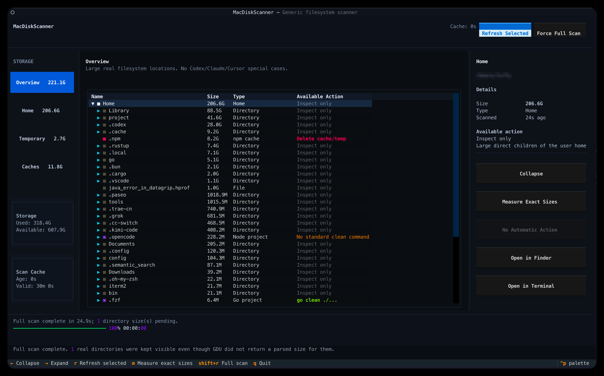

# MacDiskScanner

一个保守的开发者磁盘清理 TUI，基于 [Textual](https://textual.textualize.io/) 和 [Dundee GDU](https://github.com/dundee/gdu)。

## 设计原则

- **只显示真实文件系统层级**：目录按需展开，每次只扫描真实的下一层
- **按区域扫描**：开发工作区 / 临时目录 / 缓存 / Home 全盘四个独立区域，各区域独立缓存、可单独重扫
- **启动不自动全盘扫描**：只自动补扫三个快速区域（工作区发现、临时目录、已知缓存，秒级）；Home 全盘（含精确大小）仅在用户主动触发时执行
- **全盘扫描 = 所有区域完整扫描，补差执行**：已新鲜（30 分钟内）的区域自动跳过，只扫缺失/过期部分
- **工作区全深度发现**：遍历家目录找项目标志文件（`Cargo.toml`/`package.json` 等），命中即记录、**不测大小**；`node_modules`/`target`/`.venv`/`~/Library` 等巨型依赖与缓存目录直接剪枝，绝不进入
- **不猜 `target/build/dist` 是否可删除**：若父目录是已识别项目，构建输出归该项目自己的 clean 命令处理，不提供直接删除
- **不把深层目录伪装成上层目录**
- **无 AI 工具专用逻辑**：不针对 Codex/Claude/Cursor 做任何特殊处理，项目类型只由标准标志文件判定
- **检测到明确项目标志时，只提供项目自己的标准 clean 命令**
- **缓存 / 临时目录只对明确白名单位置提供删除**
- **普通未识别目录可手动永久删除**，但有保护边界（见下）
- **每个区域缓存 30 分钟**；过期区域在侧栏标记 `◐`，可单独重扫或由全盘扫描补齐
- **Clean 后自动重新扫描被操作的项目；Delete 后只更新被删除的缓存节点**
- **目录尺寸懒计算**：展开目录立即可用，之后在后台用一次 `du -d 1` 精确计算直接子项尺寸
- **操作期间 UI 保持可用**：一个 clean/delete 在后台运行时，仍可浏览其他目录，但不会并发启动第二个操作

## 视图

左侧导航包含四个区域视图（各带状态点与大小，状态点标记 `●` 已扫描 / `◐` 过期 / `○` 未扫描）：

| 视图 | 内容 |
|---|---|
| Workspaces | 开发工作区：家目录全深度发现的命中项目（按标志文件判定），大小在后台逐个测量（`…` 渐进变为真实值） |
| Temporary | `/private/tmp` 下匹配开发临时目录模式且 ≥ 10 MiB 的目录 |
| Caches | 白名单已知可复现的开发缓存（≥ 10 MiB） |
| Home | 全盘扫描结果：家目录的直接子项（≥ 10 MiB，或项目 / 白名单缓存），仅全盘扫描后才有数据；"全盘扫描"覆盖全部四个区域（工作区 + 临时 + 缓存 + 本视图），入口在本视图的重新扫描 |

快速区域（Workspaces / Temporary / Caches）在启动时自动补扫缺失或缺失缓存的区域；Home 保持未扫描，直到用户触发全盘扫描。

扫描时默认忽略 `~/OrbStack`（虚拟机/容器文件系统），不跨越文件系统边界；可用环境变量 `GDU_IGNORE_DIRS`（逗号分隔）扩展忽略列表。工作区发现额外剪枝 `~/Library`、`~/.cache`、`~/.npm`、`~/.cargo` 等巨型根目录，以及任意深度下的 `node_modules`、`target`、`.venv`、`.git` 等依赖/构建/VCS 目录。

## 支持的项目操作

| 检测文件 | 类型 | 操作 |
|---|---|---|
| `Cargo.toml` | Rust | `cargo clean` |
| `package.json` 且有 `scripts.clean` | Node | 按锁文件选择 `pnpm` / `yarn` / `bun` / `npm run clean` |
| `go.mod` | Go | `go clean ./...` |
| `pom.xml` | Maven | `./mvnw clean` 或 `mvn clean` |
| `build.gradle*` | Gradle | `./gradlew clean` 或 `gradle clean` |
| `Makefile` 且存在 `clean:` target | Make | `make clean` |
| `pyproject.toml` / `setup.py` | Python | 只显示类型，不执行删除 |

## 可删除区域

### 1. 白名单缓存 / 临时目录（直接 Delete）

- `~/.npm`、`~/.bun/install/cache`、`~/Library/pnpm/store`
- `~/.cargo/registry/cache`、`~/.cargo/git`
- `~/Library/Developer/Xcode/DerivedData`
- `~/.codex/cache`、`~/.codex/.tmp`
- `/private/tmp` 下匹配以下模式的目录：前缀 `cdtrader-` / `codex-`，名称包含 `gocache` / `benchmark` / `venv`，或以 `-target` / `-build` 结尾

### 2. 手动永久删除（Delete permanently…）

未识别为项目且无标准 clean 命令的普通目录/文件，可手动永久删除。以下情况**不**提供：

- Home 的直接子项
- VCS 元数据（`.git` / `.svn` / `.hg`）
- 父目录为已识别项目时的构建输出（`target`、`build`、`dist`、`out`、`.next`、`.nuxt`、`.turbo`、`coverage`)
- 受保护路径：`/`、`/System`、`/Users`、`$HOME`、`$HOME/Library`、`$HOME/.codex`、`/private`、`/private/tmp`

任何删除在执行前都会弹出确认对话框。

## 安装

推荐使用安装脚本（自动安装 Homebrew、Dundee GDU、创建虚拟环境并运行冒烟检查）：

```bash
cd MacDiskScanner
./setup.sh
```

也可以手动安装：

```bash
brew install gdu          # Dundee GDU，可执行文件名为 gdu-go（注意与 GNU coreutils 的 gdu 区分）

python3 -m venv .venv
source .venv/bin/activate
pip install -r requirements.txt
```

应用按以下顺序解析 GDU 二进制：`GDU_BIN` 环境变量 → 项目内 `.gdu-bin`（由 setup.sh 写入）→ `PATH` 中的 `gdu-go` → Homebrew 标准位置。运行 `./setup.sh` 即可自动完成这一步。

## 运行

先激活虚拟环境再启动（直接运行 `./main.py` 会使用系统 Python，缺少依赖）：

```bash
source .venv/bin/activate
./main.py
```



首次启动（无缓存）时自动扫描三个快速区域：开发工作区发现（不测大小）、`/private/tmp` 临时目录、已知缓存；Home 全盘保持未扫描。之后启动直接读取各区域缓存，过期区域标记 `◐` 可单独重扫。

## 操作

快捷键：

| 按键 | 操作 |
|---|---|
| `Enter` | 扫描 / 展开当前目录（未展开时），或折叠（已展开时） |
| `←` / `→` | 折叠 / 展开 |
| `r` | 重新测量并刷新当前节点 |
| `m` | 精确计算当前目录直接子项尺寸（后台一次 `du -d 1`） |
| `Shift+R` | 强制完整扫描（绕过缓存） |
| `q` | 退出 |

鼠标点击目录行：选中并展开/折叠。

按钮：

- 右侧面板：动作按钮（能识别 clean 命令时显示对应命令，如 `cargo clean`；否则显示 `Delete`）+ `Open in Finder` + `Open in Terminal`，共三个按钮
- Home 视图标题右侧的 `重新扫描` 即全盘扫描（弹确认框列出将扫描/将跳过的区域）
- 其余各区域视图的 `重新扫描` 仅重扫当前区域（启动时缺失的快速区域会自动补扫）；侧栏状态点标记过期/未扫描区域
- 工作区项目大小在后台逐个测量，表格中 `…` 渐进变为真实大小
- 删除按钮按当前目录大小显示（如 `Delete 12.3M`），点击后弹出确认对话框

## 缓存

```text
~/.cache/mac-disk-scanner/scan-cache.json
```

- 四个区域（workspaces / temporary / caches / home）各独立缓存、独立 30 分钟有效期，带版本号；旧版本的结果不会复用
- 缓存过期后区域标记 `◐`，可单区域 `[重新扫描]`，或触发全盘扫描由补差逻辑自动补齐（新鲜区域跳过）
- 操作失败时会在同目录写入 `action-errors.log` 便于排查